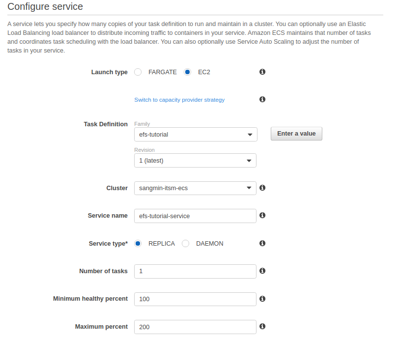
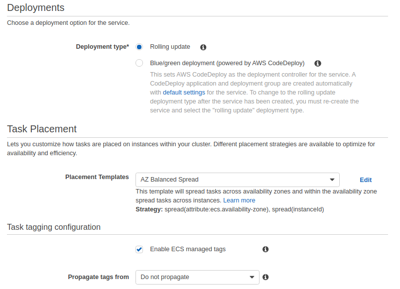
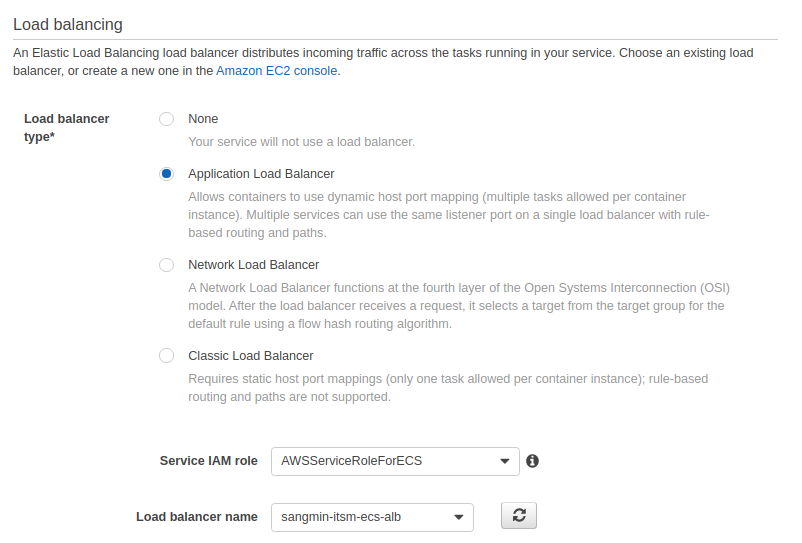
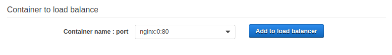
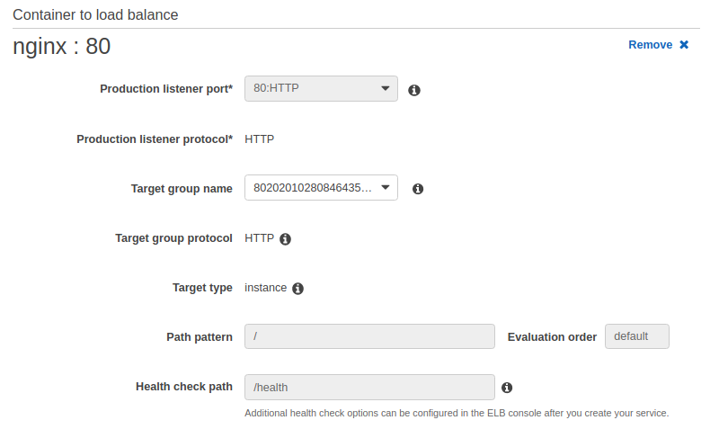
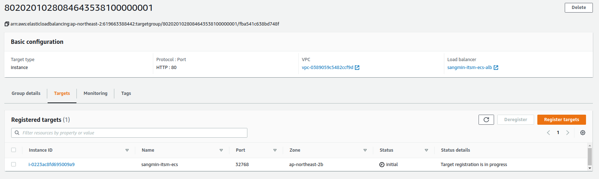
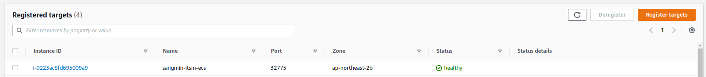
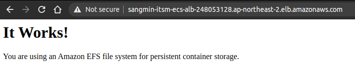

# ecs-cicd
## ECS
최적화 이미지 조회:
```bash
aws ssm get-parameters --names /aws/service/ecs/optimized-ami/amazon-linux-2/recommended
```
출력:
```json
{
    "Parameters": [
        {
            "Name": "/aws/service/ecs/optimized-ami/amazon-linux-2/recommended",
            "Type": "String",
            "Value": "{\"schema_version\":1,\"image_name\":\"amzn2-ami-ecs-hvm-2.0.20201013-x86_64-ebs\",\"image_id\":\"ami-0cc0a1657e6978861\",\"os\":\"Amazon Linux 2\",\"ecs_runtime_version\":\"Docker version 19.03.6-ce\",\"ecs_agent_version\":\"1.46.0\"}",
            "Version": 45,
            "LastModifiedDate": "2020-10-17T03:36:00.582000+09:00",
            "ARN": "arn:aws:ssm:ap-northeast-2::parameter/aws/service/ecs/optimized-ami/amazon-linux-2/recommended",
            "DataType": "text"
        }
    ],
    "InvalidParameters": []
}
```

`image_id`를 복사 후 붙여넣기

> **Info:** data.aws_ami.amazon_linux_ecs.id일 경우, 최신 버전의 ami가 아님.


### EFS
`index.html` 파일 생성:
1. 서버 접속
2. 파일 경로
- `/mnt/efs/fs1`
3. `index.html` 파일 생성:
```html
<html>
    <body>
        <h1>It Works!</h1>
        <p>You are using an Amazon EFS file system for persistent container storage.</p>
    </body>
</html>
```

### Task Definition
`taskdefinition.json` 파일:
```json
{
    "containerDefinitions": [
        {
            "memory": 512,
            "portMappings": [
                {
                    "hostPort": 0,
                    "containerPort": 80,
                    "protocol": "tcp"
                }
            ],
            "essential": true,
            "mountPoints": [
                {
                    "containerPath": "/usr/share/nginx/html",
                    "sourceVolume": "efs-html"
                }
            ],
            "name": "nginx",
            "image": "nginx"
        }
    ],
    "volumes": [
        {
            "name": "efs-html",
            "efsVolumeConfiguration": {
                "fileSystemId": "fs-05a0b364",
                "transitEncryption": "ENABLED"
            }
        }
    ],
    "family": "efs-tutorial"
}
```

항목
- containerPath : 마운트하고자 하는 컨테이너 경로
- sourceVolume : `.volumes[0].name`과 일치
- fileSystemId : efs id 입력
- hostPort : `0`입력 시 dynamic port mapping

### Service
1. 서비스 구성:



2. Deployment 설정:



3. 로드밸런서 설정:




4. 컨테이너 설정:
- `Add to load balancer`클릭:



- Target Group 설정:



5. 나머지 설정은 그대로

6. Target Group 확인
- 자동으로 인스턴스가 등록됨



- health check 정상:



7. URL 접속:

